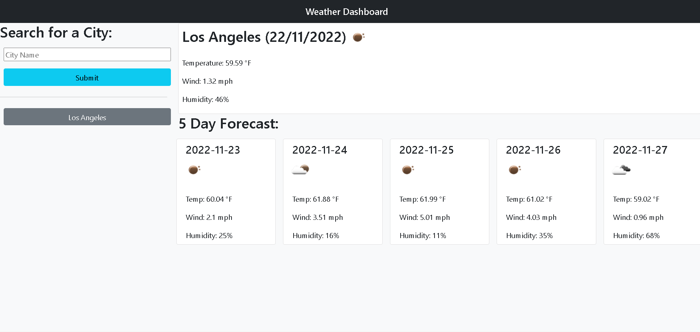

# Weather-Dashboard

## Description

In this project I created a website that will give the user a 5 day weather forecast.  The website takes a city input.  The site will then locate the city's coordinates and then find the weather for that set of coordinates.  The website will save the user's recent searches for quick access in the future.

## Usage

Visit the website at this link: 

Type the desired city into the text field and press the submit button.  A 5 day forecast will be generated.  To view the source code of the project, download the files listed.

